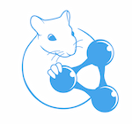

Guidelines for OKE-challenge@ESWC2015
=========

This folder contains guidelines and materials for the Open Knowledge Extraction challenge at ESWC2015.
The OKE challenge consists of three tasks, participants can choose to compete in one of more of them.
Each task will have a separate dataset. All sentences in the three datasets are of encyclopedic nature. The majority of sentences are descriptive of with respect to one main entity, e.g. if the main entity is a person the sentence will be of biographic nature.

The **example data** used in the following description of tasks is available in folder [example_data](./example_data)

A sample of the **Gold Standard data**, will be available in folder [GoldStandard_sampleData](./GoldStandard_sampleData)

Participants must:

1. Submit a paper describing their system, via [EasyChair](https://easychair.org/conferences/?conf=oke2015), no later then **March 27, 2015**. The paper should contain the details of the system, including why the system is innovative, how it uses Semantic Web, which features or functions the system provides, what design choices were made and what lessons were learned. The description should also summarise how participants have addressed the evaluation task(s). Papers must be submitted in PDF format, following the style of the Springer's Lecture Notes in Computer Science (LNCS) series (http://www.springer.com/computer/lncs/lncs+authors), and not exceeding 12 pages in length. 
2. Provide access to the application as webservice, with input/output provided in [NIF](http://persistence.uni-leipzig.org/nlp2rdf/) format. The final evaluation  will be carried out via [GERBIL](http://gerbil.aksw.org). The implementation of the evaluation for three tasks will be added on GERBIL after the acceptance of notification (**April 9, 2015**), and it will be accessible as open source code as well as [Web demo](http://gerbil.aksw.org/gerbil/config). Participants will then have time to autonomously test their system using GERBIL until the **May 15, 2015**.
3. The URI for the final system must be provided by **May 15, 2015** when the organizers will evaluate the systems against the **evaluation dataset**, which will be publicly released after announcement of results.


Task 1
=========

*Entity Recognition, Linking and Typing for Knowledge Base population.*

This task consists of (i) identifying Entities in a sentence and create an OWL individual (owl:Individual statement) representing it, (ii) link (owl:sameAs statement) such individual, when possible, to a reference KB (DBpedia) and (iii) assigning a type to such individual (rdf:type statement) selected from a set of given types.

In this task by Entity we mean any discourse referent (the actors and
objects around which a story unfolds), either named or anonymous that is an individual of one of the following [DOLCE Ultra Lite classes](http://stlab.istc.cnr.it/stlab/WikipediaOntology/): 

- Person
- Place
- Organization
- Role

Entities also include anaphorically related discourse referents. Hence, anaphora resolution has to be take into account for addressing the task.

As an example, for the sentence: 

> Florence May Harding studied at a school in Sydney, and with Douglas Robert Dundas , but in effect had no formal training in either botany or art.	

we want the system to recognize four entities:

| Recognized Entity    | generated URI | Type     | SameAs|
| ------------- |:-------------|:-------------:| -----:|
| Florence May Harding      |oke:Florence_May_Harding| dul:Person | dbpedia:Florence_May_Harding |
| school      | oke:School|dul:Organization    |    |
| Sydney | oke:Sydney| dul:Place      |    dbpedia:Sydney  |
| Douglas Robert Dundas |oke:Douglas_Robert_Dundas| dul:Person      |      |

The results must be provided in [NIF](http://persistence.uni-leipzig.org/nlp2rdf/) format, including the offsets of recognized entities. The expected output for the example sentence can be found in [task1.ttl](./example_data/task1.ttl).

In the above example we use

```
@prefix oke: <http://www.ontologydesignpatterns.org/data/oke-challenge/task-1/>
```


We will evaluate three aspects on this task, independently:

- Ability to recognize entities: we will check if all strings recognizing entities are identified, using the offsets returned by the systems. **Only full matches are counted as correct** (e.g. if the system returns "Art School" instead of "National Art School" is counted as a miss).
- Ability to **assign the correct type**: evaluation will be carried out only on the 4 target DOLCE types.
- Ability to **link individuals to DBpedia 2014**: participants must **link** entities to DBpedia **only when relevant** (in the example sentence, the referred Douglas Robert Dundas is not present in DBpedia)

We will calculate Precision, recall and F1 for the three subtasks and the winner for task 1 will be the system with higher average F1 for all three.

Task 2
=========

*Class Induction and entity typing for Vocabulary and Knowledge Base enrichment.*

This task consists in producing rdf:type statements, given definition texts. The participants will be given a dataset of sentences, each defining an entity (known a priori), e.g. the entity: dpedia:Skara_Cathedral and its definition "Skara Cathedral is a church in the Swedish city of Skara".

Participants are expected to (i) identify the type(s) of the given entity as they are expressed in the given definition, (ii) create a owl:Class statement for defining each of them as a new class in the target knowledge base, (iii) create a rdf:type statement between the given entity and the new created classes, and (iv) align the identified types, if a correct alignment is available, to a set of given types.

In the task we will evaluate the extraction of all strings describing a type and the alignment to any of the subset of [DOLCE+DnS Ultra Lite classes](http://ontologydesignpatterns.org/ont/wikipedia/d0.owl)


As an example, for the sentence: 

> Brian Banner is a fictional villain from the Marvel Comics Universe created by Bill Mantlo and Mike Mignola and first appearing in print in late 1985..

*Brian Banner* will be given as the *input target entity*. We want the system to recognize any possible type for it. Correct answers include:


| Recognized string for the type    | Generated Type     | rsubClassOf|
| ------------- |:-------------| -----:|
| fictional villain      |oke:FictionalVillain| dul:Personification | 
| villain      | oke:Villain|dul:Person    |  

The results must be provided in [NIF](http://persistence.uni-leipzig.org/nlp2rdf/) format, including the offsets of recognized string describing the type. The expected output for the example sentence can be found in [task2.ttl](./example_data/task2.ttl).

In the above example we use

```
@prefix oke: <http://www.ontologydesignpatterns.org/data/oke-challenge/task-2/>
```


We will evaluate two aspects on this task, independently:

- Ability to **recognize strings that describe the type of a target entity**. As string describing types often include adjectives as modifiers (in the example above, "fictional" is a modifier for villain), in the Gold Standard we will include all possible options; the system answer will be counted **correct as long as at least one of the possibility is returned**.
- Ability to align the identified type with a reference ontology, which for this evaluation will be the subset of [DOLCE+DnS Ultra Lite classes](http://ontologydesignpatterns.org/ont/wikipedia/d0.owl). 

We will calculate Precision, recall and F1 for the two subtasks and the winner for task 2 will be the system with higher average F1 for the two of them.


Task 3
=========

*Relation extraction and naming, and triple generation for Ontology and Knwoledge Base enrichment.*

The participants will be given as input a sentence and two entities contained in the sentence. The task consists in (i) assessing whether the sentence contains an evidence of a relation between the two input entities and if true (ii) the creation of a OWL property representing the relation, including a value for its rdf:label annotation statement, and (iii) the production of a statement for the relation.
The triple must be of the form <entity1> <relation> <entity2>; where: 
a. <entity1>, <entity2> are the input URIs, i.e., the given pair of entities as subject and object of the statement 
b. <relation> is the OWL property learnt as predicate. 
The URI for the predicate must be created by the participants and we will not require the linking with a reference KB.
The participants are encouraged to use the following rule to create the URI for the relation:

* use the namespace <http://www.ontologydesignpatterns.org/data/oke-challenge/task-3/>
* and concatenate an arbitrary chosen name for the relation

The participants are required to produce a label for the relation, using the rdfs:label statement. The label should include the portion of text that expresses the relation.

For all examples of task 3 we use

```
@prefix oke: <http://www.ontologydesignpatterns.org/data/oke-challenge/task-3/>
```


As an example, for the sentence: 

> In 1956 Coleman moved to Chicago, along with Booker Little, where he worked with Gene Ammons and Johnny Griffin before joining Max Roach Quintet 1958-1959.

We will give as input the two entities

- http://dbpedia.org/resource/George_Coleman
- http://dbpedia.org/resource/Gene_Ammons

The system is expected to identify that the text expresses a relation between the two and to produce a statement such as 


```
oke:workedWith
     a       owl:ObjectProperty ;
     rdfs:label "worked with"@en ;
     dc:relation oke:69_80_workedWith .
```

The results must be provided in [NIF](http://persistence.uni-leipzig.org/nlp2rdf/) format, including the offsets of recognized string(s) describing the relation. 
The expected output for the example sentence can be found in [task3.ttl](./example_data/task3.ttl).

If the strings expressing the relation in the text are not contiguous, participants can return multiple offset statements. 

For example, for the sentence:

>Wayne Koestenbaum (born 1958) is an American poet and cultural critic. He received a B.A. from Harvard University, an M.A. from Johns Hopkins University, and a Ph.D. from Princeton University.

where the two given input entities are:

- http://dbpedia.org/resource/Wayne_Koestenbaum
- http://dbpedia.org/page/Princeton_University


We expect the participants 

```
oke:receivedphdfrom
     a       owl:ObjectProperty ;
     rdfs:label "received a Ph.D. from"@en ;
     dc:relation oke:74_82_received, oke:60_170_phd_from .
```


We will evaluate two aspects on this task, independently:

- Ability to recognize if a text expresses a relation or not. Being a binary task, we will count the percentage of correct answers.
- Ability to produce a meaningful label for an identified relation. We will use a similarity measure of the produced string against the gold standard. As final measure we will score systems based on the average similarity score of all produced relation labels.

The winner for task 3 will be the system with higher linear combination of the score for the two subtasks.

Results
=========

**Task 1**

| Annotator | Micro F1 | Micro Precision | Micro Recall | Macro F1 | Macro Precision | Macro Recall |
|-----------|----------|-----------------|--------------|----------|-----------------|--------------|
| Adel      | 0.6075   |     0.6938      |    0.5403    |  0.6039  |      0.685      |     0.54     |
| FOX       | 0.4988   |     0.6639      |    0.4099    |  0.4807  |      0.6329     |     0.4138   |
| FRED      | 0.3473   |     0.4667      |    0.2766    |  0.2278  |      0.3061     |     0.1814   |

**Task 2**

| Annotator | Micro F1 | Micro Precision | Micro Recall | Macro F1 | Macro Precision | Macro Recall |
|-----------|----------|-----------------|--------------|----------|-----------------|--------------|
| CETUS     | 0.4735   |     0.4455      |    0.5203    |  0,4478  |      0.4182     |     0.5328   |
| Sheffield | 0.4416   |     0.5155      |    0.39      |  0.3939  |      0.3965     |     0.3981   |
| FRED      | 0.3043   |     0.2893      |    0.3211    |  0.2746  |      0.2569     |     0.3173   |

*Powered by*



Winners
=========

**Task 1**
 - Adel - Julien Plu, Giuseppe Rizzo and Raphaël Troncy. *A Hybrid Approach for Entity Recognition and Linking*

**Task 2**
 - CETUS - Michael Röder, Ricardo Usbeck and Axel-Cyrille Ngonga Ngomo. *CETUS — A Baseline Approach to Type Extraction*