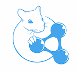

Participating systems
=========

For Task 1 the participants are:

- **FOX**: Michael Röder, Ricardo Usbeck and Axel-Cyrille Ngonga Ngomo.  [CETUS — A Baseline Approach to Type Extraction](./participating systems/OKE2015_submission_1.pdf)
- **FRED**: Sergio Consoli and Diego Reforgiato.  [Using FRED for Named Entity Resolution, Linking and Typing for Knowledge Base population](./participating systems/OKE2015_submission_3.pdf)
- **Adel**: Julien Plu, Giuseppe Rizzo and Raphaël Troncy. [A Hybrid Approach for Entity Recognition and Linking](./participating systems/OKE2015_submission_2.pdf)

For Task 2 the participants are:

- **CETUS**: Michael Röder, Ricardo Usbeck and Axel-Cyrille Ngonga Ngomo.  [CETUS — A Baseline Approach to Type Extraction](./participating systems/OKE2015_submission_1.pdf)
- **FRED**: Sergio Consoli and Diego Reforgiato.  [Using FRED for Named Entity Resolution, Linking and Typing for Knowledge Base population](./participating systems/OKE2015_submission_3.pdf)
- **OAK@Sheffield**: Jie Gao and Suvodeep Mazumdar. [Exploiting Linked Open Data to Uncover Entity Type](./participating systems/OKE2015_submission_4.pdf)

**Results for Task 1**

| Annotator | Micro F1 | Micro Precision | Micro Recall | Macro F1 | Macro Precision | Macro Recall |
|-----------|----------|-----------------|--------------|----------|-----------------|--------------|
| Adel      | 0.6075   |     0.6938      |    0.5403    |  0.6039  |      0.685      |     0.54     |
| FOX       | 0.4988   |     0.6639      |    0.4099    |  0.4807  |      0.6329     |     0.4138   |
| FRED      | 0.3473   |     0.4667      |    0.2766    |  0.2278  |      0.3061     |     0.1814   |

**Results for Task 2**

| Annotator | Micro F1 | Micro Precision | Micro Recall | Macro F1 | Macro Precision | Macro Recall |
|-----------|----------|-----------------|--------------|----------|-----------------|--------------|
| CETUS     | 0.4735   |     0.4455      |    0.5203    |  0,4478  |      0.4182     |     0.5328   |
| OAK@Sheffield | 0.4416   |     0.5155      |    0.39      |  0.3939  |      0.3965     |     0.3981   |
| FRED      | 0.3043   |     0.2893      |    0.3211    |  0.2746  |      0.2569     |     0.3173   |

*Powered by*

Winners
=========

**Task 1**
 - Adel - Julien Plu, Giuseppe Rizzo and Raphaël Troncy. *A Hybrid Approach for Entity Recognition and Linking*

**Task 2**
 - CETUS - Michael Röder, Ricardo Usbeck and Axel-Cyrille Ngonga Ngomo. *CETUS — A Baseline Approach to Type Extraction*